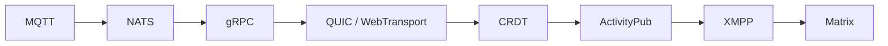

# Silent Odyssey 🚀

**Silent Odyssey** 是一个以协议为核心的实验与探索项目。  
目标是通过逐步实现从轻量级消息协议到复杂联邦通信协议（Matrix）的完整路线，验证 [Silent 框架](https://github.com/silent-rs/silent) 的生产力级别、健壮性与可扩展性。

---

## ✨ 为什么是 Odyssey？
- **验证框架能力**：不仅是性能，还包括协议兼容性、稳定性和扩展性。  
- **渐进式挑战**：从简单到复杂，逐层加码，最终以 Matrix 作为“最终 Boss”。  
- **可复用成果**：每一阶段都会沉淀为独立子仓库（如 `silent-mqtt`），方便社区直接使用。  

---

## 🗺️ 路线图总览

---

## 路线图概览

### 第一阶段：MQTT ⭐
- **目标**：实现一个轻量级 MQTT Broker。  
- **实验内容**：  
  - 使用 `mosquitto_pub/sub` 等标准客户端进行互操作。  
  - 测试连接保持、主题订阅与 QoS (0/1/2) 行为。  
- **产出**：一个可运行的 demo 与压测报告。  

---

### 第二阶段：NATS ⭐⭐
- **目标**：开发简化版 NATS 服务。  
- **实验内容**：  
  - 使用 `nats-bench` 工具进行并发压测。  
  - 验证多路复用性能与持久化消息能力。  
- **产出**：支持请求-响应与 Pub/Sub 的服务端实现。  

---

### 第三阶段：gRPC (HTTP/2) ⭐⭐
- **目标**：为 Silent 集成 gRPC handler。  
- **实验内容**：  
  - 使用 Protobuf 定义服务接口。  
  - 设计双向流场景（如实时聊天）。  
  - 验证背压控制与跨语言互通。  
- **产出**：跨语言可调用的 gRPC 服务。  

---

### 第四阶段：QUIC / WebTransport ⭐⭐⭐
- **目标**：集成基于 Rust `quinn` 的 QUIC 或 WebTransport。  
- **实验内容**：  
  - 文件传输与低延迟场景压测。  
  - 验证多路复用、0-RTT 握手与丢包恢复。  
- **产出**：Silent 支持新一代传输协议的 demo。  

---

### 第五阶段：CRDT 协议 ⭐⭐⭐
- **目标**：实现协同编辑与最终一致性。  
- **实验内容**：  
  - 使用 Automerge / Yjs 构建文本协作服务。  
  - 支持离线更新与状态合并。  
- **产出**：具备 CRDT 同步能力的 Silent 服务。  

---

### 第六阶段：ActivityPub ⭐⭐⭐
- **目标**：实现简化的联邦社交协议。  
- **实验内容**：  
  - 搭建支持关注/消息发布的 ActivityPub server。  
  - 与 Mastodon 等 Fediverse 客户端互通。  
  - 验证 JSON-LD、签名鉴权、联邦消息分发。  
- **产出**：最小可用的去中心化社交节点。  

---

### 第七阶段：XMPP ⭐⭐⭐
- **目标**：搭建基础 XMPP 服务端。  
- **实验内容**：  
  - 支持消息与状态同步。  
  - 验证 MUC（多人聊天室）、PubSub 等扩展。  
- **产出**：一个可互通的 XMPP 服务器，强调兼容性与实时性。  

---

### 第八阶段：Matrix 🌌
- **目标**：实现最小化 Matrix HomeServer。  
- **实验内容**：  
  - 接入 Matrix 联邦网络，运行 Synapse / Dendrite 互通测试。  
  - 验证复杂房间模型、联邦同步与端到端加密。  
- **产出**：Silent 驱动的 Matrix 节点，作为生产力级别的终极验证。  

---

## 仓库结构与使用说明
- 每个阶段对应独立子仓库，例如：`silent-mqtt`、`silent-nats`。  
- 本主仓库用于展示整体路线图与记录进展。  
- 欢迎在 Issues 中提出问题、讨论设计，也欢迎提交 PR 一起推进实验。